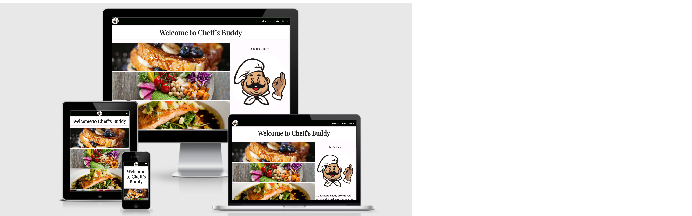

# Project summary:

This is a simple cookbook app that will help users decide on what new recipe they would like to try out.
This project was designed to showcase understanding of Python making use of the Flask Framework in combination with Jinja and MongoDb.
The app was designed to be easily expanded upon in future releases.
The project has been deployed on Heroku [here](https://cheffs-buddy.herokuapp.com/).

## Showcase 

## navigation

* [UX](#ux)
  + [User-stories](#user-stories)
* [Structure](#structure)
* [Wireframes](#wireframes)
* [Features](#features)
* [Testing](#testing)
* [Deployment](#deployment)
* [Credits](#credits)

# UX

## User Stories: 

## Owners goals:

### As owner of this app I would like:

- to provide users with an intuitive experience while browsing the app.
- to allow users to register to the application.
- to allow users to edit their own recipes.
- to provide an incentive to create good recipes.

### As a new/unregistered user I would like to:

- Be able to explore the recipes on the site.
- Be able to view a full description of the recipe.
- Navigate the app intuitively. 
- Easily understand what this website is about.
- Search for recipes based on products used.

### As a registered user I would like to:

- Be able to login easily
- Be able to save my favorite recipes.
- Be able to create a recipe.
- Be able to like and unlike recipes.
- Sort recipes by category

## Structure: 

The website is layed out in the following way:

- User arrives on the landing page
> Option to browse website as a guest or login/signup
- After user is logged in he/she can start creating recipes. Logging in
or signing up takes user immediatly to their profile.
> A user can edit their own recipes, but only look at recipes created by other people.
- If user chooses to explore as a guest he/she can only look at other people's recipes.
> full recipes are still available.

## Skeleton:

### Design changes:

I tried to stay as close to the original wireframes as possible.
However design alterations were quite minor.

## Wireframes: 

Wireframes for the layout of the project can be found here: [here](static/images/wireframe/Milestone3.png)

### Wireframing data:

Data is storder in 3 different ways:
1. Categories: The original plan was to have 4 dropdowns to insert the recipes in based on the category they belong to.
2. Recipes: These consist out of:
- Recipe_name
- Category_name
- recipe_instructions (this is an array)
- created_by
- ingredients (this is an array)
- image_url
- description

## Surface: 

### Fonts: 

 The main font used in the project is Playfair Display with a fallback of serif.

### Colors:

The main colors used were black: #000500 and white: #FFFBFF
This decision was made to keep everything nice and clean with images adding in more color throughout the page.

### Images:

All images are taken from either:

- Unsplash:
- Pexels:
- The logo used was taken from Freepik: 

# Features: 

## Current Features: 

- A user is able to sign up to the website.
- A user is able to login/logout of the website.
- A user is able to create their own recipes.
- A user is able to edit their created recipes.
- A user is able to delete their own recipes.
- A user is able to look at recipes created by other people.
- A user is able to see a full description of the recipe.
- A user is able to see all recipes they created on their profile page under my recipes.
- A user is able to search for recipes based on the ingredients used or recipe name.
- Submit and cancel buttons for the forms.

## Future Features: 

- A user is able to like a recipe which is then stored in their profile page.
- A user is able to comment on recipes created by other people.
- A user is able to have a clear overview of recipes in tabs of each category.
- Pagination to be added so the screen doesn't get too long when a lot of recipes are in the database.
- Users can upload images from their computer or phone.
- Admin functionality.

# Technologies used:

## Languages: 

- HTML
- CSS
- javaScript
- Python

## Libraries:

- JQuery: for easier and faster javascript and DOM manipulation.
- Matrialize: used for creating a responsive design.
- Flask: used as Python web framwork.
- PyMongo: used as Python distribution containing tools for working with MongoDb.
- Flask-PyMongo: used as a bridge between Flask and PyMongo.
- Werkzeug: used for password hasing and authentication. 
- Jinja: for displaying backend data on the screen.

## Other programs used:

- Balsamiq: for wireframing.
- Google Fonts: for the fonts used.
- [Github](https://github.com/)
- [Visual Studio Code](https://code.visualstudio.com/): as a IDE (Integrated Development Environment) for developing the project
- [Git](https://en.wikipedia.org/wiki/Git): for version control
- Google Chrome Dev Tools: for testing purposes. Console logging checking for breakpoints.
- Prettier: to beautify code. 
- FontAwesome: used for icons throughout the website [FontAwesome](https://fontawesome.com/)
- Heroku to deploy the project

## Code validation:

- [JShint](https://jshint.com/) to validate JavaScript code
> No major errors found in javaScript code. Warnings given for using jQuery
- [W3 CSS Validator](https://jigsaw.w3.org/css-validator/) to validate CSS code
> Warns user that backdrop-fliter isn't a property. Explained in bug section further.
- [W3 HTML Validator](https://validator.w3.org/) to validate HTML code
> All HTML-code passes the test. However multiple warnings were given for using the Jinja Templating Language.
- [Python Syntax Checker](https://extendsclass.com/python-tester.html) to verify syntax used.
> No issues were found when running code. However some warnings are given in the IDE.  

# Testing: 

Most testing was done during development:
- Whenever a function was written in app.py I would check that everything would display on the screen as it was intended.
- Whenever data would be send to the database I would check in mongoDb whether it was stored in the correct way.
- When writing Jinja template language I would check my output in the browser.
- Using chrome devtools responsiveness off all elements implemented with materialize would be checked.
> There is an issue when the screen is between 994 and 1800px wide when the Name of the recipe is too long that the full recipe link dissapears.(solved)

## User Stories Testing:

## Owners goals:

### As owner of this app I would like:

- to provide users with an intuitive experience while browsing the app.
> The App is responsive throughout the entire application, barring small hickups on really small screens and screens inbetween M-L.
- to allow users to register to the application.
> Registering is easy and intuitive, extra security features will be implemented in the future.
- to allow users to edit their own recipes.
> Editing is easy and intuitive by either finding the recipe in the my_recipe collection or clicking on the edit button on the recipe card.
- to provide an incentive to create good recipes.
> The liking system is not in place as of yet.

### As a new/unregistered user I would like to:

- Be able to explore the recipes on the site.
> From the landing screen you are able to directly browse the website by clicking the link or clicking the logo.
- Be able to view a full description of the recipe.
> Click on the link of each respective card to take the user to the full recipe page.
- Navigate the app intuitively. 
> Navigating the app is fluent on whichever device the user is viewing it on.
- Easily understand what this website is about.
> On the landing screen it showcase nice screenshots of dishes, further browsing the website it showcases every created recipe in a nice card with a screenshot
showcasing the dish.
- Search for recipes based on products used.
> In the search bar on the homepage a user can type in ingredients they would like to use and it returns a recipe based on that.

### As a registered user I would like to:

- Be able to login easily
> Click login
- Be able to save my favorite recipes.
> Not implemented as of yet, the liking was harder to implement than expected.
- Be able to create a recipe.
> In the add recipe page a user is able to fill in a form that sends the recipe to the database and then renders it in their created recipes page and 
on the all recipes page.
- Be able to like and unlike recipes.
> not implemented as of yet
- Sort recipes by category
> not implemented as of yet however a search bar was added to search based on ingredients used in recipes.

# BUGS and other issues:

# Existing Bugs

# Deployment:

# Credits: 

## Content and Media:

## Acknowledgments:

**This project was created for educational purposes only, credit for all images goes to their owners**

**Created by Thijs Terporten**

